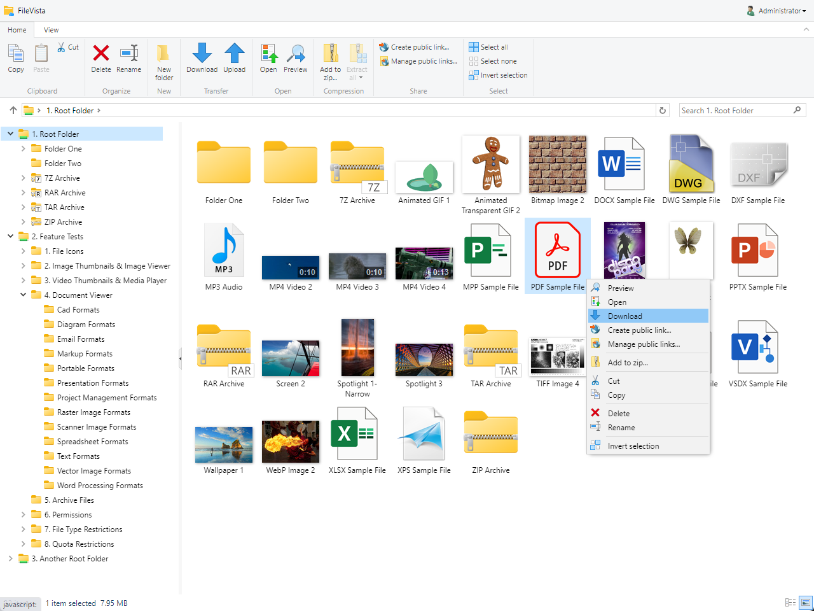

# File Manager for Self-Hosted File Sharing

Turn your web site into a web file server in few minutes.

- Share files with your clients or staff on your web site.
- Store your confidential files on your own server and have full control over them.
- Enable your users to securely access, upload and organize documents from anywhere with only a web browser.
- Preview documents (70+ file formats, including PDF & Microsoft Office), images, audios and videos.

<kbd></kbd>

**Note:** This project contains a fully working version of the product, however without a license key it will run in trial mode. For more information, please see [Web File Manager (Self-Hosted File Sharing, Own Cloud Storage)](https://www.gleamtech.com/filevista) product page.

### Live Demo:
https://demos.gleamtech.com/filevista/

### Showcase videos:

